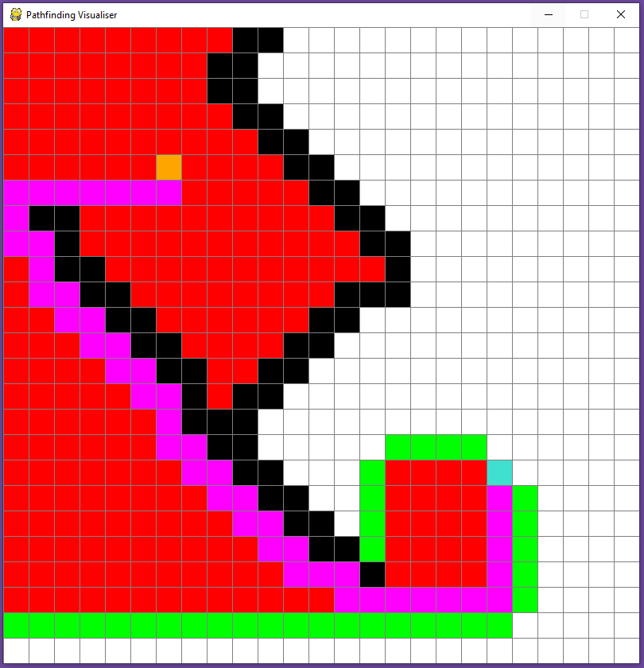

# pathfinding-visualiser

###  Context
This project provides Python code that visualises the following path finding algorithms:
- The A* algorithm
- Dijkstra's algorithm
- Depth first search (DFS)

### Instructions
Ensure that you have python and pygame installed on your machine. Then you can run `pathfinding.py` to launch the project.  
- Use your left mouse button to place the start (orange) point, end (blue) point and barriers.
- You can delete drawn cells using the right mouse button.
- The space bar clears the grid.
- Press 1 for A*, 2 for Dijkstra's and 3 for DFS.

